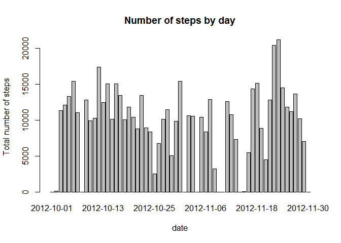
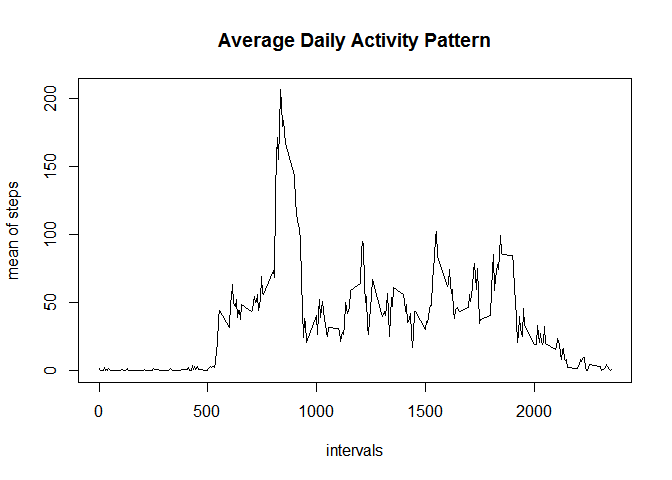
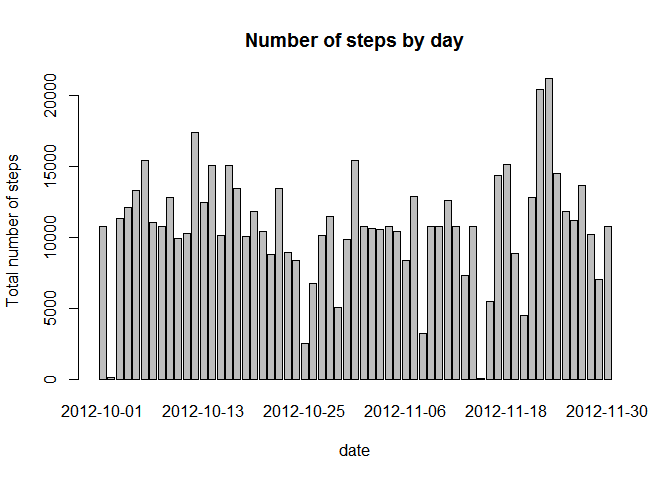
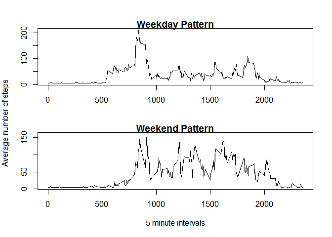

# Reproducible Research: Peer Assessment 1


## Loading and preprocessing the data

Load the file after download to working directory


```r
Tdata <- read.csv("activity.csv")
head(Tdata)
```

```
##   steps       date interval
## 1    NA 2012-10-01        0
## 2    NA 2012-10-01        5
## 3    NA 2012-10-01       10
## 4    NA 2012-10-01       15
## 5    NA 2012-10-01       20
## 6    NA 2012-10-01       25
```


## What is mean total number of steps taken per day?

Once data is imported we use aggregate function to calculate total steps for each day.
Then plot histogram... and calculate mean and median


```r
Totalstepsperday <- aggregate(Tdata$steps, by=list(date=Tdata$date),sum, na.rm = TRUE)
MeanTotalstepsperday <- mean(Totalstepsperday$x)
print(paste("Mean of total steps per day is:", MeanTotalstepsperday))
```

```
## [1] "Mean of total steps per day is: 9354.22950819672"
```

```r
MedianTotalstepsperday <- median(Totalstepsperday$x)
print(paste("Median of total steps per day is:", MedianTotalstepsperday))
```

```
## [1] "Median of total steps per day is: 10395"
```

```r
names(Totalstepsperday) <- c("date","TotalSteps")
with(Totalstepsperday, {    
  barplot(height=TotalSteps, names.arg=date, xlab="date",
  ylab="Total number of steps", main = "Number of steps by day")
  })
```

<!-- -->


## What is the average daily activity pattern?

Then we find average steps per day across all intervals using aggregate function and compute interval that has maximum average steps.


```r
Stepsperinterval <- aggregate(steps ~ interval, data = Tdata, FUN = mean)
with(Stepsperinterval, {plot(interval, steps, type="l", xlab="intervals", ylab="mean of steps", 
main="Average Daily Activity Pattern")})
```

<!-- -->

```r
Maxaveragesteps <- max(Stepsperinterval$steps)
Intervalmaxsteps <- Stepsperinterval$interval[Stepsperinterval$steps == Maxaveragesteps]
print(paste("Interval with maximun average steps is:", Intervalmaxsteps))
```

```
## [1] "Interval with maximun average steps is: 835"
```
## Imputing missing values

We then calculate and the total number of missing values in the dataset and then replace NA values with the mean for that interval.


```r
Totalmissing <- sum(is.na(Tdata$steps))
Totalnumberofobservations <- nrow(Tdata)
Tdata$missingsteps <- Tdata$steps
Tdata$missingsteps[is.na(Tdata$steps)] <- mean(Tdata$steps, na.rm=TRUE)

Totalstepsperdayimputed <- aggregate(Tdata$missingsteps, by=list(date=Tdata$date),sum, na.rm = TRUE)
names(Totalstepsperdayimputed) <- c("date","TotalSteps")
with(Totalstepsperdayimputed, {    
  barplot(height=TotalSteps, names.arg=date, xlab="date",
  ylab="Total number of steps", main = "Number of steps by day")
  })
```

<!-- -->

```r
Meantotalstepsperday <- mean(Totalstepsperdayimputed$TotalSteps) 
print(paste("Mean of total steps per day is:", Meantotalstepsperday))
```

```
## [1] "Mean of total steps per day is: 10766.1886792453"
```

```r
Mediantotalstepsperday <- median(Totalstepsperdayimputed$TotalSteps)          
print(paste("Median of total steps per day is:", Mediantotalstepsperday))
```

```
## [1] "Median of total steps per day is: 10766.1886792453"
```
By replacing the NAs in steps with mean of the intervals we find that the mean and median of the Total number of steps per day has slightly indreased

## Are there differences in activity patterns between weekdays and weekends?

We find that there is significant difference in activity between weekdays and weekends.There is continuous up and down activity on weekdays where as on weekend significant part of activity is limited to the early set of timeintervals.


```r
Tdata$dayofweek <- weekdays(as.Date(Tdata$date))
Weekend <- c("Sunday","Saturday")
for (variable in 1:Totalnumberofobservations) 
{
  if(Tdata$dayofweek[variable] %in% Weekend) 
  {
    Tdata$dayofweek[variable] <- "weekend"
    
  }
  else
  {
    Tdata$dayofweek[variable] <- "weekday"
  }
}
Tdata$dayofweek <- factor(Tdata$dayofweek)
Weekdayplot <- aggregate(missingsteps ~ interval, data = Tdata, subset = (Tdata$dayofweek == "weekday"), FUN = mean)
Weekendplot <- aggregate(missingsteps ~ interval, data = Tdata, subset = (Tdata$dayofweek == "weekend"), FUN = mean)
par(mfrow=c(2, 1), mar=c(4, 3, 1, 1),oma=c(1, 1, 2, 1)) 
with(Weekdayplot, {plot(interval, missingsteps, type="l", xlab = "", ylab=" ", 
main="Weekday Pattern")})
with(Weekendplot, {plot(interval, missingsteps, type="l", xlab="5 minute intervals", ylab=" ", 
                        main="Weekend Pattern")})
mtext("Average number of steps", side = 2, outer = TRUE)
```

<!-- -->
